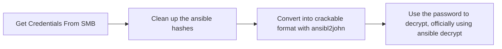

# Scans 
## Rustscan 

## Nmap Scan 
```
PORT     STATE SERVICE       VERSION
53/tcp   open  domain        Simple DNS Plus
80/tcp   open  http          Microsoft IIS httpd 10.0
| http-methods: 
|_  Potentially risky methods: TRACE
|_http-server-header: Microsoft-IIS/10.0
|_http-title: IIS Windows Server
88/tcp   open  kerberos-sec  Microsoft Windows Kerberos (server time: 2026-07-18 03:06:14Z)
135/tcp  open  msrpc         Microsoft Windows RPC
139/tcp  open  netbios-ssn   Microsoft Windows netbios-ssn
389/tcp  open  ldap          Microsoft Windows Active Directory LDAP (Domain: authority.htb, Site: Default-First-Site-Name)
|_ssl-date: 2026-07-18T03:08:13+00:00; +3h59m59s from scanner time.
| ssl-cert: Subject: 
| Subject Alternative Name: othername: UPN:AUTHORITY$@htb.corp, DNS:authority.htb.corp, DNS:htb.corp, DNS:HTB
| Not valid before: 2022-08-09T23:03:21
|_Not valid after:  2024-08-09T23:13:21
445/tcp  open  microsoft-ds?
464/tcp  open  kpasswd5?
593/tcp  open  ncacn_http    Microsoft Windows RPC over HTTP 1.0
636/tcp  open  ssl/ldap      Microsoft Windows Active Directory LDAP (Domain: authority.htb, Site: Default-First-Site-Name)
|_ssl-date: 2026-07-18T03:08:13+00:00; +4h00m00s from scanner time.
| ssl-cert: Subject: 
| Subject Alternative Name: othername: UPN:AUTHORITY$@htb.corp, DNS:authority.htb.corp, DNS:htb.corp, DNS:HTB
| Not valid before: 2022-08-09T23:03:21
|_Not valid after:  2024-08-09T23:13:21
3268/tcp open  ldap          Microsoft Windows Active Directory LDAP (Domain: authority.htb, Site: Default-First-Site-Name)
|_ssl-date: 2026-07-18T03:08:13+00:00; +3h59m59s from scanner time.
| ssl-cert: Subject: 
| Subject Alternative Name: othername: UPN:AUTHORITY$@htb.corp, DNS:authority.htb.corp, DNS:htb.corp, DNS:HTB
| Not valid before: 2022-08-09T23:03:21
|_Not valid after:  2024-08-09T23:13:21
3269/tcp open  ssl/ldap      Microsoft Windows Active Directory LDAP (Domain: authority.htb, Site: Default-First-Site-Name)
|_ssl-date: 2026-07-18T03:08:14+00:00; +4h00m00s from scanner time.
| ssl-cert: Subject: 
| Subject Alternative Name: othername: UPN:AUTHORITY$@htb.corp, DNS:authority.htb.corp, DNS:htb.corp, DNS:HTB
| Not valid before: 2022-08-09T23:03:21
|_Not valid after:  2024-08-09T23:13:21
5985/tcp open  http          Microsoft HTTPAPI httpd 2.0 (SSDP/UPnP)
|_http-server-header: Microsoft-HTTPAPI/2.0
|_http-title: Not Found
8443/tcp open  ssl/http      Apache Tomcat (language: en)
| ssl-cert: Subject: commonName=172.16.2.118
| Not valid before: 2026-07-16T02:41:32
|_Not valid after:  2028-07-17T14:19:56
|_http-title: Site doesn't have a title (text/html;charset=ISO-8859-1).
|_http-trane-info: Problem with XML parsing of /evox/about
|_ssl-date: TLS randomness does not represent time
Aggressive OS guesses: Microsoft Windows Server 2016 (93%), Microsoft Windows Server 2019 (93%), Microsoft Windows 10 21H2 (90%), Microsoft Windows 10 (89%), Microsoft Windows 10 1709 - 1803 (89%), Microsoft Windows 10 1709 - 21H2 (89%), Microsoft Windows 10 1809 - 21H2 (89%), Microsoft Windows 11 21H2 (89%), Microsoft Windows 10 1703 (89%), Microsoft Windows 10 1803 (89%)
No exact OS matches for host (test conditions non-ideal).
Network Distance: 2 hops
Service Info: Host: AUTHORITY; OS: Windows; CPE: cpe:/o:microsoft:windows

Host script results:
|_clock-skew: mean: 3h59m59s, deviation: 0s, median: 3h59m59s
| smb2-security-mode: 
|   3:1:1: 
|_    Message signing enabled and required
| smb2-time: 
|   date: 2026-07-18T03:08:03
|_  start_date: N/A

TRACEROUTE (using port 80/tcp)
HOP RTT       ADDRESS
1   79.98 ms  10.10.16.1
2   303.96 ms 10.129.30.252

OS and Service detection performed. Please report any incorrect results at https://nmap.org/submit/ .
Nmap done: 1 IP address (1 host up) scanned in 152.01 seconds
oscp-prep/authority » 
```
```
oscp-prep/authority » sudo nmap -sV -sC -p 445 $ip --script=vuln                         
Starting Nmap 7.95 ( https://nmap.org ) at 2026-07-17 23:44 UTC
Pre-scan script results:
| broadcast-avahi-dos: 
|   Discovered hosts:
|     224.0.0.251
|   After NULL UDP avahi packet DoS (CVE-2011-1002).
|_  Hosts are all up (not vulnerable).
Nmap scan report for 10.129.30.252
Host is up (0.13s latency).

PORT    STATE SERVICE       VERSION
445/tcp open  microsoft-ds?

Host script results:
|_smb-vuln-ms10-054: false
|_samba-vuln-cve-2012-1182: Could not negotiate a connection:SMB: Failed to receive bytes: ERROR
|_smb-vuln-ms10-061: Could not negotiate a connection:SMB: Failed to receive bytes: ERROR

Service detection performed. Please report any incorrect results at https://nmap.org/submit/ .
Nmap done: 1 IP address (1 host up) scanned in 61.42 seconds
```
## Nuclei-scan 
```
[waf-detect:modsecurity] [http] [info] http://10.129.30.252
[ldap-metadata] [javascript] [info] 10.129.30.252:389 ["DomainControllerFunctionality: 7","BaseDN: dc=389","DnsHostName: authority.authority.htb","DefaultNamingContext: DC=authority,DC=htb","DomainFunctionality: 7","ForestFunctionality: 7"]
[ldap-anonymous-login-detect] [javascript] [medium] 10.129.30.252
[smb-enum] [javascript] [info] 10.129.30.252:445 ["DNSComputerNamen: authority.authority.htb","DNSComputerName: authority.authority.htb","ForestName: authority.htb","OSVersion: 10.0.17763","NetBIOSComputerName: AUTHORITY","NetBIOSDomainName: HTB"]
[smb-enum-domains] [javascript] [info] 10.129.30.252:445 ["DomainName: authority.htb"]
[smb-os-detect] [javascript] [info] 10.129.30.252:445 ["Windows Server 2019, Version 1809"]
[smb-version-detect:smb-version] [javascript] [info] 10.129.30.252:445 ["SMB 2.1"]
[smb2-capabilities] [javascript] [info] 10.129.30.252:445 ["["DFSSupport","LargeMTU","Leasing"]"]
[smb2-server-time] [javascript] [info] 10.129.30.252:445 ["SystemTime: 2026-07-18T03:16:45.000Z ServerStartTime: 2009-04-22T19:24:48.000Z"]
[smb-anonymous-access] [javascript] [high] 10.129.30.252:445
[smb-shares] [javascript] [low] 10.129.30.252:445 ["[ADMIN$ C$ Department Shares Development IPC$ NETLOGON SYSVOL]"] [FQDN="10.129.30.252",Host="10.129.30.252",Hostname="10.129.30.252:445",Port="445",password="",username="admin"]
[options-method] [http] [info] http://10.129.30.252 ["OPTIONS, TRACE, GET, HEAD, POST"]
[default-windows-server-page] [http] [info] http://10.129.30.252
[microsoft-iis-version] [http] [info] http://10.129.30.252 ["Microsoft-IIS/10.0"]
[http-missing-security-headers:strict-transport-security] [http] [info] http://10.129.30.252
[http-missing-security-headers:permissions-policy] [http] [info] http://10.129.30.252
[http-missing-security-headers:x-frame-options] [http] [info] http://10.129.30.252
[http-missing-security-headers:x-content-type-options] [http] [info] http://10.129.30.252
[http-missing-security-headers:referrer-policy] [http] [info] http://10.129.30.252
[http-missing-security-headers:cross-origin-opener-policy] [http] [info] http://10.129.30.252
[http-missing-security-headers:content-security-policy] [http] [info] http://10.129.30.252
[http-missing-security-headers:x-permitted-cross-domain-policies] [http] [info] http://10.129.30.252
[http-missing-security-headers:cross-origin-embedder-policy] [http] [info] http://10.129.30.252
[http-missing-security-headers:cross-origin-resource-policy] [http] [info] http://10.129.30.252
[tech-detect:ms-iis] [http] [info] http://10.129.30.252
```
# Observations 
- Obviously a windows machine
- Several ports open
- Services to check
- ## SMB
   - Can I connect?
   - No, access denied
   - Not smbV1 version
   - nxc smb $ip -u admin -p pass # guest
   - nxc smb 10.129.30.252 -u '' -p ''
   - nxc smb $ip -u admin -p "" --shares # reveals actual shares, thanks to nuclei scan i found out this was possible #spidering shares is possible
   - Turns out guest users can download files when using -u admin and -p '' as their credentials
 ### Credentials 
 ldap_bind_password = sunrise 
 
 pwm_admin_password = password 
 
 tomacat_users = username = "admin" password = T0mc@tAdm1n
 
 pwm_admin_pasword = !vault
 


- LDAP
   - Can I connect?
   - ldapwhoami -x -H ldap://target.com # unsuccessful
   - ldapsearch -x -H ldap://target.com -b "dc=example,dc=com" # unsuccessful 
   - ldapsearch -x -H ldaps://$ip:636 -D "cn=admin,dc=authority,dc=htb" -w password -b "dc=authority,dc=htb" # unsuccessful
   - ldapsearch -x -H ldap://$ip -b "dc=authority,dc=htb"  #unsucessful 
   - ldapsearch -x -H ldap://$ip -b "" -s base "(objectclass=*)" # worked
 
- Port 80
  - Reveals exposed internet information services information
 
- RPCClient
   - Connection is possible, but without authnetication, use is extremely limited 
  ```
   - rpcclient -U "" -N $ip
   ```
- Port 8443
  - Reveals a private login for username and password
```
 
PWM is currently in configuration mode. This mode allows updating the configuration without authenticating to an LDAP directory first. End user functionality is not available in this mode.

After you have verified the LDAP directory settings, use the Configuration Manager to restrict the configuration to prevent unauthorized changes. After restricting, the configuration can still be changed but will require LDAP directory authentication first.
```
Clicking on configuration mode reveals that a user has authentticated successfully form the address 10.129.204.183. 
- Host seems down, If it is up, but blocking probes, try -Pn
- Identity was svc_pwm DC=htb,DC=corp
- had been trying to authenticate to ldap search by using the wrong thang
- Looks like authentication through no identity has been done with address 127.0.0.1
>[!NOTE]
>Saw this
>The PWM (Password Management for LDAP) does not have a default password; it requires you to set a configuration password during the initial setup. You must create a strong password for configuration access when you first configure PWM.

Credential Combinations That Were Tried 
```
root:!vault 
root:password
admin:password 
admin:!vault
```
Configuration Password Values Tried 
password 
!vault 
sunrise

- Need to log into pwm but don't know how
- Have had several authentication failures but not sure what to do about it
- Have read access to important information via smb but unsure how to exploit/use since ca't connect to ldap

--correct format for ansible hashes 

### Admin-Pass
```
$ANSIBLE_VAULT;1.1;AES256
31356338343963323063373435363261323563393235633365356134616261666433393263373736
3335616263326464633832376261306131303337653964350a363663623132353136346631396662
38656432323830393339336231373637303535613636646561653637386634613862316638353530
3930356637306461350a316466663037303037653761323565343338653934646533663365363035
6531
```
```
admin-pass: !@#$%^&*
admin-pass: !@#$%^&* 
```
### Admin-Login 


```
!@#$%^&*

pWm_@dm!N_!23% # for some reason, actual password does not contain the %, which was throwing me off 

svc_pwm
```


